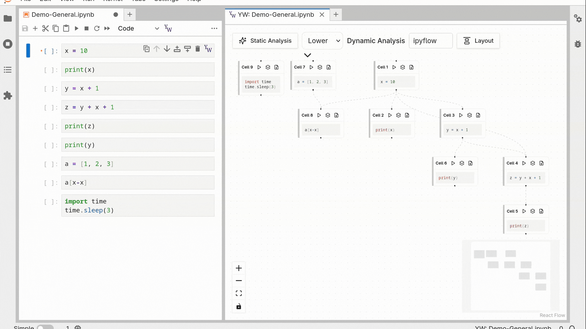
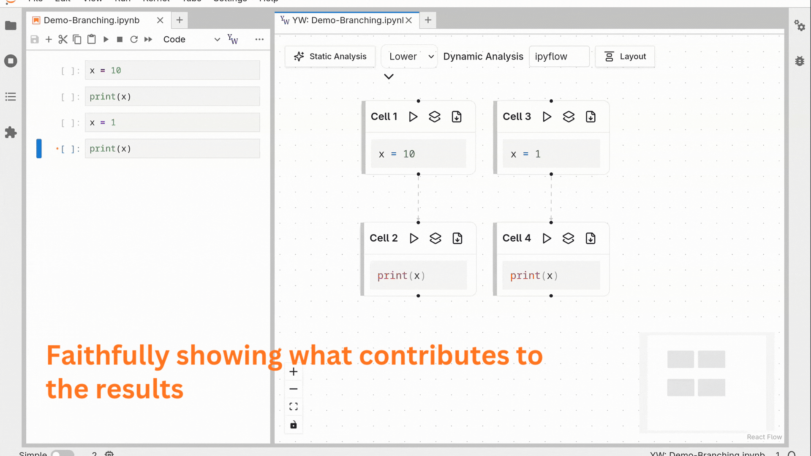

# yw-jupyter


`yw-jupyter` is a JupyterLab extension that visualizes notebook code cell execution states and relationships as an
interactive dependency graph.

- The **graph** reflects the current Python execution state, including both executed cells and those that have not yet been run.
- A **node** represents a unit of code that is either executed or not yet executed (idle). Since Jupyter runs the code cell by cell, a node typically corresponds to a notebook cell. (See the warning below for explanations.)
- A **directed edge** represents a dependency between nodes, showing the relationship between different units of code.

> [!IMPORTANT]
> **A notebook cell can correspond to one or more nodes---if a cell is executed multiple times or subsequently edited, multiple nodes should be created to faithfully represent each execution state.**
> **In the current prototype, users can mitigate this by duplicating the cell before editing.**
> 
> > This creates a new node that can be executed independently while preserving the original node and its downstream dependents unchanged.
> > An executed node that is subsequently edited is marked as stale (orange) to inform users of this unwanted behavior, 
> > visually distinguished from idle nodes that have never been executed.
> > This will be improved in future iterations.


**Static analysis** via [`yw-core`](https://github.com/CIRSS/yw-core) predicts data flow between cells from source code alone, letting users understand notebook structure before execution.

**Dynamic analysis** via [`ipyflow`](https://github.com/ipyflow/ipyflow) tracks actual runtime cell dependencies as they execute, producing precise dependency edges.


## Features

### Graph Visualization for Notebook Cells and Execution States



- Open the extension through sidebar or cell toolbar.
- Side-by-side view of notebook cells and graph, and cells and graph nodes are in sync:
  - Editing cells updates the contents in the node and vice versa.
  - The colored sidebar of the node indicates the status of the cell.
- The graph shows notebook cells as nodes and data flow between them as edges:
  - Dashed edges show predicted dependencies from static analysis.
  - Solid edges show definite dependencies from dynamic dataflow tracking.
- Selecting a node highlights its full upstream dependencies.
- Reproducing a leaf node's output by exporting the code of its upstream dependencies.

### Untangling the Output Results



- Showing the upstream dependencies that contribute to a node's output.

## Install

### PyPI

> [!TIP]
> Recommended method

```bash
pip install yw-jupyter
```

### Install from source

- Requirements:
  - `JupyterLab` >= 4.0.0
  - `yw-core` >= 0.1.0, < 1.0.0
  - `ipyflow`

```bash
git clone https://github.com/CIRSS/yw-jupyter.git yw-jupyter
cd yw-jupyter
jlpm install
jlpm build:lib
jlpm build:prod
jupyter labextension develop . --overwrite
```

## Troubleshooting

Make sure we see `yw-jupyter` is enabled in JupyterLab extensions list:

```bash
>>> jupyter labextension list
JupyterLab v4.5.3
~/Documents/GitHub/yw-jupyter/.venv/share/jupyter/labextensions
        jupyterlab_pygments v0.3.0 enabled OK (python, jupyterlab_pygments)
        yw-jupyter v1.0.0 enabled OK
```

## Known Issues and Future Work

- Code block's cursor in graph node not matching the actual cursor position.
- Bugs when multiple notebooks and yw-jupyter extensions are open in JupyterLab simultaneously.
- Supporting more general kernels.
